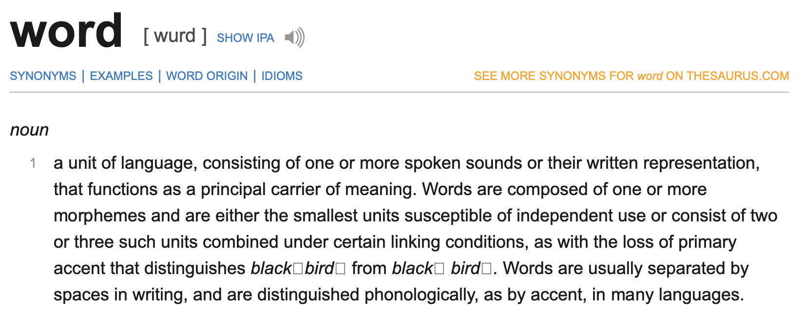

# Javascript Objects and Classes

## Overview

-   What are objects and why do we use them
-   Classes and how they make development clearer
    -   Data structure integrity
    -   Reusability
    -   Extensibility

---

## What are objects and why do we use them

> Objects in JavaScript, just as in many other programming languages, can be compared to objects in real life. The concept of objects in JavaScript can be understood with real life, tangible objects. - [Mozilla Developer Network](https://developer.mozilla.org/en-US/docs/Web/JavaScript/Guide/Working_with_Objects)

Think of objects as a dictionary; as in a words with their definition



As you can see, a dictionary contains a bunch of words with their definition.

Javascript objects also operate in a similar fashion with keys and values

```js
// We create a new Object and assign it to myDog
let myDog = new Object()

// Now imagining it as a dictionary, we can assign 'words' with their 'definition' or more accurately, assign properties with their value

// set the property 'name' on 'myDog' to be 'cat'
myDog.name = 'cat'
// set the property 'color' on 'myDog' to be 'brown'
myDog.color = 'brown'
// set the property 'age' on 'myDog' to be '5'
myDog.age = 5
```

Where did the property come from? It is created on the spot when we defined it. So prior to `myDog.name = 'cat';`, `name` does not exist.

[](./assets/node-myDog-example.mp4)

```js
// We can do the same thing with square brackets
let myDog = new Object()
myDog['name'] = 'cat'
myDog['color'] = 'brown'
myDog['age'] = 5
```

So from this, you can see that there a 2 ways to access / set the property of an object: using the `.` or `[]` operators.

```js
// We can also use the object literal which is preferred
let myDog = {}
myDog.name = 'cat'
myDog.color = 'brown'
myDog.age = 5

// OR all at once

let myDog = {
    name: 'cat',
    color: 'brown',
    age: 5,
}

// We can still add on to myDog
myDog.favoriteFood = 'bone'
```

[//]: # 'Throughout the examples, show the actual code in action along with its current state, probably use vscode debugger to show it'

Throughout these examples, you can see that I am using objects in javascript to kind of define what my dog is. That is the idea behind javascript objects, which is to mimic real world features in.

### A Todo list in code

Imagine that we need to model how a todo list works with javascript. How might we do something like that?

From our understanding in todo lists, we know that it basically boils down to a list of tasks that are either 'Done' or 'Not Done'

Let's make a simple todo object

```js
let todo = {}
todo.name = 'Make a todo list in javascript'
todo.done = false

// {
//     name: 'Make a todo list in javascript',
//     isDone: false
// }
```

As you can see, our object is modelling how a todo in real life might look like. It contains the name of the todo, along with the state of the todo (isDone)

Now this is just 1 todo, we have to make a list of them so.

```js
// Make a list
let todoList = []

// Make our first todo
let todo1 = {}
todo1.name = 'Task 1'
todo1.isDone = false

// Add it to the list
todoList.push(todo1)

// Make our second todo
let todo2 = {
    name: 'Task 2',
    isDone: true,
}

// Add it to the list
todoList.push(todo2)

// Create our third todo and add it directly to the list
todoList.push({
    name: 'Task 3',
    isDone: true,
})

// [
//   { name: 'Task 1', isDone: false },
//   { name: 'Task 2', isDone: true },
//   { name: 'Task 3', isDone: true }
// ]
```

From this example, you see that we can also directly create and pass objects to functions.

In fact if we wanted to we could have just created the whole list directly and skip all the `.push()` functions

```js
let todoList = [
    { name: 'Task 1', isDone: false },
    { name: 'Task 2', isDone: true },
    { name: 'Task 3', isDone: true },
]
```

Creating the objects like this is quite manually and we have to type the same syntax over and over again. Let's use functions to help us with this.

```js
function Todo(name, isDone) {
    this.name = name
    this.isDone = isDone
    this.createdOn = new Date()
}

let t1 = new Todo('Task created from function', true)

// Todo {
//   name: 'Task created from function',
//   isDone: true,
//   createdOn: 2019-07-23T15:15:15.865Z
// }
```

Well you might be wondering, this doesn't seem like a normal function. Well that's because it is not a normal function.

Also what are the keywords `new` and `this` for?

Let's start from `new`. It does a few things:

1.  It creates a new empty object `{}`
2.  It makes the `this` refer to the newly created object in the function we are calling
3.  It then runs the code in the function
4.  It then returns the created object from the function despite not having a return statement

Now that we see how new works with the 'constructor' function (constructor because it created an object in a specific manner), let's add another functionailty which is to get how long it has been since the todo has been created

```js
// this function returns us how long it
// has been since the todo was created
// in milliseconds
function getTimeSinceTodoCreated(todo) {
    return new Date() - todo.createdOn
}

// Example usage
let millisecondsPassedSinceCreation = getTimeSinceTodoCreated(t1)
console.log(millisecondsPassedSinceCreation) // some number
```

We created the function, but it is quite specific for the Todo object, is the a way we could park this function under the Todo objects instead of the global scope?

```js
// We put the method under the prototype
Todo.prototype.getTimeSinceCreated = function() {
    return new Date() - this.createdOn
}

// Now we can do

t1.getTimeSinceCreated() // some number
```

So all together now

```js
function Todo(name, isDone) {
    this.name = name
    this.isDone = isDone
    this.createdOn = new Date()
}

Todo.prototype.getTimeSinceCreated = function() {
    return new Date() - this.createdOn
}

let t1 = new Todo('Task created from function', true)
// Todo {
//     name: 'Task created from function',
//     isDone: true,
//     createdOn: 2019-07-23T15:15:15.865Z
// }

t1.getTimeSinceCreated() // Some number
```

---

## Class Syntax

Previously we saw how to create a 'constructor' that creates objects for us in a specific manner and also provide functions to be used by objects through the prototype

Now we shall take a look at the `class` syntax

```js
class Todo {
    constructor(name, isDone) {
        this.name = name
        this.isDone = isDone
        this.createdOn = new Date()
    }

    getTimeSinceCreated() {
        return new Date() - this.createdOn
    }
}

let t1 = new Todo('Task created from function', true)
// Todo {
//     name: 'Task created from function',
//     isDone: true,
//     createdOn: 2019-07-23T15:15:15.865Z
// }

t1.getTimeSinceCreated() // Some number
```

From the example above, you can see how class make it easier to do whatever we just did with functions previously. This cleaner looking code is what we call 'Syntactic sugar' as it makes the previous implementation easier and shorter.

Now let's do a new system. We will try to simulate a simple secondary school personnel database. We shall use the new class syntax for this.

In a school we have teachers and students, so we shall be modelling that to keep track of the personnels in a school.

First we have a generic template that is common for both teachers and students.

```js
class Person {
    // dateOfBirth format - dd-mmm-yyyy
    constructor(firstName, lastName, gender, dateOfBirth) {
        this.firstName = firstName
        this.lastName = lastName
        this.gender = gender
        this.dateOfBirth = new Date(dateOfBirth)
    }

    getAge() {
        let millisecondsDifference = new Date() - this.dateOfBirth
        let age = millisecondsDifference / 1000 / 60 / 60 / 24 / 365
        return Math.floor(age)
    }
}
```

First we create a `Person` class as a template to create more `Person`s later.

```js
// We can create `Person` objects
let p1 = new Person('John', 'Doe', 'male', '20-mar-2000')
let p2 = new Person('Jane', 'Doe', 'female', '31-dec-2001')
```

We are creating `Person` class as our common base for our next classes `Teacher` and `Student`.

```js
class Teacher extends Person {
    constructor(firstName, lastName, gender, dateOfBirth, subject, year) {
        super(firstName, lastName, gender, dateOfBirth)
        // subject refers to which subject the teacher is teaching
        this.subject = subject
        // year refers to which year the teacher is teaching
        // e.g. Year 4 classes
        this.year = year
    }
}

// So we can create teachers like so
let t1 = new Teacher('Sarah', 'Tan', 'female', '7-jun-1985', 'physics', 3)
let t2 = new Teacher('Benjamin', 'Lee', 'male', '21-sep-1973', 'english', 2)

// And we can store the information of these teachers in an array

let teachers = [t1, t2]
```

Let's do the same thing for students

```js
class Student extends Person {
    constructor(firstName, lastName, gender, dateOfBirth, grades, year) {
        super(firstName, lastName, gender, dateOfBirth)
        // grades is a list of subjects with their respective grades
        this.grades = grades
        this.year = year
    }
}

// So we can create students like so
let s1 = new Student(
    'Cathy',
    'Ng',
    'female',
    '18-aug-2005',
    [{ english: 'A', physics: 'B' }],
    2
)
let s2 = new Student(
    'Alex',
    'Teo',
    'male',
    '26-apr-2004',
    [{ english: 'B', physics: 'C' }],
    3
)

// And we can store the information of these students in an array

let students = [s1, s2]
```
